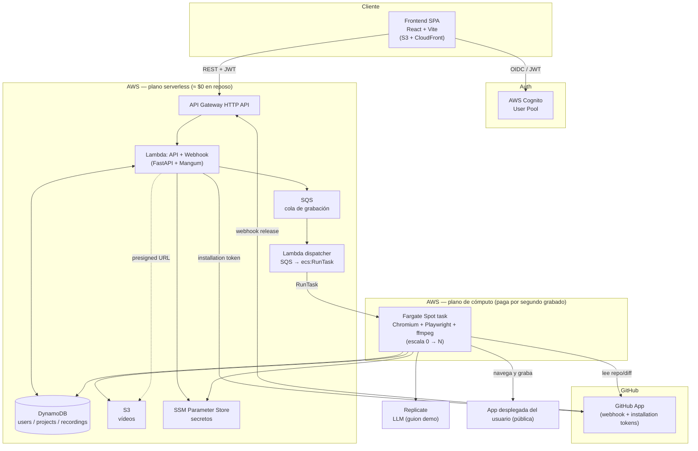

# Release Demo Recorder — Documento de Requisitos v1

> Estado: propuesta para validación · Fecha: 2026-08-01
> Decisiones fijadas: apps target **públicas** · prioridad **coste ≈ $0** · IA en **Replicate**

---

## 1. Resumen ejecutivo y veredicto de viabilidad

La app permite a un usuario conectar su cuenta de GitHub (instalando una **GitHub App**),
crear proyectos (repo + URL de despliegue) y, **automáticamente en cada release**, generar
un **vídeo de demostración profesional** de los cambios, navegando la app desplegada con un
cursor humano, subtítulos y resaltados. El vídeo queda almacenado para verlo y descargarlo.

**Veredicto: viable.** Es una arquitectura estándar (frontend SPA + API serverless + cola +
workers + almacenamiento de objetos). El grabador ya está probado end-to-end en el MVP actual.
Solo **dos áreas** concentran el riesgo de ingeniería real:

1. **Acertar la ruta correcta** de una app compleja cuando el cambio no está en la home (RF-9).
2. **Mantener fluidez del vídeo bajo carga** (RNF-2), que choca con abaratar la CPU del worker.

Ambas son resolubles y se detallan en §6 y §12. El resto es integración conocida.

---

## 2. Objetivos y alcance

### En alcance (v1)

- Frontend web + backend API.
- Autenticación con **AWS Cognito**.
- Onboarding con instalación de **GitHub App** (acceso a repos sin webhooks manuales).
- CRUD de proyectos (repo URL, deploy URL, nombre, descripción).
- Webhook automático de release → cola → worker → grabación.
- Grabación **multi-página**, capaz de navegar a rutas no principales según los cambios.
- Almacenamiento de vídeos + metadatos; ver/descargar desde la app.
- Infra como código con **Terraform**, empaquetado con **Docker**, todo en **AWS**.
- Diseño **escalable** con coste **cercano a la capa gratuita**.

### Fuera de alcance (v1) → fast-follow

- Grabar apps **detrás de login** (target siempre público en v1). Se deja el modelo de datos
  preparado para credenciales de prueba por proyecto, pero sin implementarlo.
- Edición de vídeo, voz en off/TTS, subtítulos multi-idioma.
- Equipos/organizaciones con roles (v1 = usuario individual).
- Reintentos avanzados, panel de analítica.

---

## 3. Actores y flujos

**Actor:** usuario desarrollador que quiere demos automáticas de sus releases.

### Flujo A — Onboarding (primera vez)

1. Registro/login vía Cognito (Hosted UI).
2. La app le pide **instalar la GitHub App** → redirección a GitHub → el usuario elige repos.
3. GitHub devuelve un `installation_id` (callback) → se asocia al usuario.
4. A partir de aquí la app puede leer repos, releases y diffs, y **recibe releases por webhook
   sin configurar nada por repo**.

### Flujo B — Crear proyecto

1. El usuario da: URL del repo, URL de despliegue, nombre, descripción (opcional).
2. Se valida que el repo esté entre los de su instalación.

### Flujo C — Release → vídeo (automático)

1. El usuario publica una release en GitHub.
2. GitHub envía un evento `release` a nuestro webhook (endpoint único de la GitHub App).
3. El backend valida la firma, resuelve el proyecto y **encola** un job.
4. Un **worker** con CPU garantizada arranca, planifica la demo con IA y graba.
5. El vídeo se sube a S3; los metadatos se guardan en BD; el usuario lo ve en la app.

---

## 4. Arquitectura de alto nivel



---

## 5. Stack tecnológico (con justificación)

| Capa                     | Elección                                                           | Por qué (dado coste≈$0)                                                                                                             |
| ------------------------ | ------------------------------------------------------------------ | ----------------------------------------------------------------------------------------------------------------------------------- |
| **Frontend**             | React + Vite (SPA) en **S3 + CloudFront**                          | Estático = lo más barato y escalable. CloudFront free tier 1 TB/mes.                                                                |
| **Auth**                 | **Cognito User Pool** (Hosted UI/OIDC)                             | 50.000 MAU gratis. Backend valida JWT vía JWKS.                                                                                     |
| **API + Webhook**        | **FastAPI** sobre **Lambda** (Mangum) + **API Gateway HTTP API**   | Sin ALB (~$16/mes) ni servidor siempre encendido. Free tier: 1M req Lambda + 1M API GW. Reutiliza el código FastAPI actual.         |
| **Cola**                 | **SQS** (+ DLQ)                                                    | 1M req/mes gratis. Desacopla API de la grabación.                                                                                   |
| **Orquestación workers** | Lambda _dispatcher_ que hace `ecs:RunTask` (Fargate) por mensaje   | **Escala a cero**: sin jobs, no hay cómputo → $0.                                                                                   |
| **Worker de grabación**  | **Fargate Spot**, imagen Docker con Playwright + Chromium + ffmpeg | vCPU **garantizada** (fluidez) pagando **solo los segundos que graba**. ~céntimos/vídeo.                                            |
| **Base de datos**        | **DynamoDB** (single-table)                                        | Serverless real, $0 en reposo, 25 GB free perpetuo. Modelo simple (users/projects/recordings). Encaja con Lambda sin VPC/RDS Proxy. |
| **Vídeos**               | **S3** privado + **URLs prefirmadas**                              | 5 GB free. Vídeos ~0,5–2 MB.                                                                                                        |
| **Secretos**             | **SSM Parameter Store** (SecureString)                             | Gratis (Secrets Manager cuesta $0,40/secreto/mes).                                                                                  |
| **IA planificación**     | **Replicate** (`meta/meta-llama-3-70b-instruct`)                   | Decisión del cliente; ya integrado. Abstraído tras interfaz por si se migra a Bedrock.                                              |
| **IaC**                  | **Terraform**                                                      | Requisito. Módulos por servicio.                                                                                                    |
| **Registro imágenes**    | **ECR**                                                            | 500 MB free. Imágenes de API y worker.                                                                                              |
| **CI/CD**                | **GitHub Actions** → build/push ECR + `terraform apply`            | Gratis para repos.                                                                                                                  |

### Nota clave de coste vs. fluidez

El **worker no puede ir en free tier burstable** (t3.micro): una grabación es CPU sostenida a
25 fps y un t3.micro **agota créditos de CPU y tira frames** → rompe RNF-2 (fluidez). Por eso el
worker va en **Fargate Spot con vCPU fija**, que da CPU garantizada **y** escala a cero. Todo lo
demás (Lambda, DynamoDB, SQS, S3, Cognito, CloudFront) sí vive en free tier. Resultado: **≈$0 en
reposo + céntimos por vídeo**. (Alternativa aún más barata pero con riesgo de throttling: un único
**EC2 t3.micro** free-tier con swap corriendo el worker en modo secuencial — se documenta como
opción, no recomendada si la fluidez es innegociable.)

---

## 6. Componentes detallados

### 6.1 Frontend (React + Vite)

- Páginas: Login (Cognito), Onboarding/instalar GitHub App, Lista de proyectos, Crear proyecto,
  Detalle de proyecto con lista de grabaciones y **reproductor** + botón descargar.
- Auth: OIDC contra Cognito; guarda el JWT y lo manda en `Authorization: Bearer`.
- Polling ligero (o WebSocket futuro) del estado de una grabación en curso.

### 6.2 Autenticación (Cognito)

- **User Pool** con Hosted UI (email + password, verificación por email).
- El backend valida el `id_token`/`access_token` con el **JWKS** de Cognito (issuer + audience).
- `sub` de Cognito = clave primaria del usuario en DynamoDB.

### 6.3 Integración con GitHub (GitHub App, no OAuth App)

Es la pieza que cumple RF-3 y RF-5 de forma limpia:

- Se registra **una** GitHub App con:
  - **Permisos:** _Contents: read_ (leer diff/archivos), _Metadata: read_.
  - **Eventos suscritos:** _Release_.
  - **Webhook** único con secreto → nuestro endpoint.
- El usuario **instala** la App en sus repos → obtenemos `installation_id`.
- Para llamar a la API de GitHub, el backend firma un **JWT con la clave privada de la App** y lo
  canjea por un **installation access token** (corto, por instalación).
- **Ventaja:** los webhooks de release llegan solos para _todos_ los repos instalados; no hay que
  crear webhooks por repositorio. Además podemos leer el **diff entre tags** (qué cambió).

### 6.4 API + Webhook (FastAPI en Lambda)

Endpoints principales:

- `POST /webhook/github` — valida `X-Hub-Signature-256`, filtra `action=published`, resuelve
  proyecto por `repo_full_name`, crea `recording (status=queued)` y **encola en SQS**.
- `GET /projects`, `POST /projects`, `GET /projects/{id}`, `GET /recordings/{id}` (con URL
  prefirmada del vídeo), `GET /github/installation/callback`, etc.
- Cold start de Lambda es aceptable para un webhook (segundos), y no afecta a la fluidez del vídeo.

### 6.5 Cola y escalado a cero

- SQS recibe `{recording_id}`. Una **Lambda dispatcher** (trigger SQS) lanza **un Fargate task por
  mensaje** con `ecs:RunTask` (Fargate **Spot**, red pública sin NAT para abaratar).
- **Tope de concurrencia** configurable (p. ej. máx. 5 tasks) para evitar sustos de coste.
- **DLQ** para mensajes fallidos; una regla de reconciliación marca `error` si un task muere.

### 6.6 Motor de grabación (el corazón)

Reutiliza y extiende el grabador actual ([recorder.py](../app/recorder.py)). Fases dentro del task:

**Fase 1 — Planificación (sin grabar):**

1. Lee **notas de la release** (payload) + **archivos cambiados** vía GitHub _compare_
   (`GET /repos/{o}/{r}/compare/{prevTag}...{newTag}`).
2. **Descubre rutas** de la app desplegada: intenta `/sitemap.xml`; si no, hace un _crawl_ somero
   de enlaces desde la raíz para construir un inventario de rutas.
3. Heurística **archivo→ruta** (p. ej. `src/pages/settings/*.tsx` → `/settings`) para sugerir
   dónde mirar cuando el cambio no está en la home.
4. Envía a Replicate: notas + archivos cambiados + rutas disponibles + inventario de elementos →
   **guion multi-página** en JSON.

**Esquema de guion extendido** (nuevo `navigate`):

```json
{
  "title": "...",
  "steps": [
    { "action": "navigate", "path": "/settings", "narration": "..." },
    { "action": "highlight", "text": "...", "narration": "..." },
    { "action": "click", "text": "...", "narration": "..." },
    { "action": "type", "text": "...", "value": "...", "narration": "..." },
    { "action": "scroll", "direction": "down", "amount": 500 },
    { "action": "wait", "ms": 1200 }
  ]
}
```

**Fase 2 — Grabación (con vídeo):**

- Un **único Chromium por task** (nada de empaquetar navegadores) → CPU dedicada = fluidez.
- Cursor DOM humano + subtítulos + resaltados (ya implementado).
- `navigate` va a `deploy_url + path`.
- Transcodificación a **MP4 H.264 a fps fijo** con ffmpeg (`+faststart`).
- Cada paso aislado en `try` (un selector que falle no rompe la demo).

**Fase 3 — Publicación:** sube MP4 a **S3** (`s3://.../{user}/{project}/{recording}.mp4`) y
actualiza el registro en DynamoDB (`status=done`, `s3_key`, `duration`).

### 6.7 IA de planificación (Replicate, abstraída)

- Interfaz `Planner.generate(notes, changed_files, routes, element_inventory) -> Plan`.
- Implementación `ReplicatePlanner`; **fallback** determinista (tour con scroll) si la IA falla,
  para que **siempre** haya vídeo.
- Preparado para intercambiar por `BedrockPlanner` en el futuro sin tocar el grabador.

---

## 7. Modelo de datos (DynamoDB single-table)

| Entidad                         | PK                      | SK                    | Atributos                                                                                          |
| ------------------------------- | ----------------------- | --------------------- | -------------------------------------------------------------------------------------------------- |
| **User**                        | `USER#{cognitoSub}`     | `PROFILE`             | email, github_installation_id, created_at                                                          |
| **Project**                     | `USER#{cognitoSub}`     | `PROJECT#{projectId}` | name, description, repo_url, repo_full_name, deploy_url, created_at                                |
| **Recording**                   | `PROJECT#{projectId}`   | `REC#{ts}#{recId}`    | release_tag, release_name, status, target_routes[], plan_json, s3_key, duration, error, created_at |
| **Índice repo→proyecto** (GSI1) | `REPO#{repo_full_name}` | `PROJECT#{projectId}` | (para resolver el webhook rápido)                                                                  |

> `auth_config` (credenciales de prueba cifradas) se reserva en `Project` para el fast-follow de
> apps con login; **no se usa en v1**.

---

## 8. Requisitos funcionales

- **RF-1** El sistema ofrece frontend y backend desacoplados.
- **RF-2** El usuario se autentica con Cognito (registro, verificación, login, logout).
- **RF-3** En el primer uso, el usuario instala la GitHub App y se guarda su `installation_id`.
- **RF-4** El usuario crea proyectos con repo URL, deploy URL, nombre y descripción opcional.
- **RF-5** Cada `release published` genera automáticamente (vía webhook) un job de grabación.
- **RF-6** El worker planifica la demo a partir de las **notas de la release**.
- **RF-7** El worker sube el vídeo y persiste sus metadatos; el usuario puede **verlo y descargarlo**.
- **RF-8** El vídeo muestra cursor visible, movimiento humano, subtítulos y resaltados.
- **RF-9** La grabación puede **navegar a rutas no principales** cuando los cambios están ahí.
- **RF-10** Si la IA falla, se usa un guion de respaldo y **siempre** se produce un vídeo.
- **RF-11** El usuario ve el **estado** de cada grabación (queued/recording/done/error).

## 9. Requisitos no funcionales

- **RNF-1 Escalabilidad:** workers escalan **0 → N** por profundidad de cola; API serverless.
- **RNF-2 Fluidez:** vídeo a fps fijo sin caídas → **vCPU garantizada por worker**, 1 navegador/task.
- **RNF-3 Coste:** ≈$0 en reposo; marginal por vídeo. Tope de concurrencia para acotar gasto.
- **RNF-4 Seguridad:** JWT en toda la API; firma de webhook validada; secretos en SSM; S3 privado.
- **RNF-5 Aislamiento:** un usuario solo accede a sus proyectos/grabaciones (autorización por `sub`).
- **RNF-6 Observabilidad:** logs en CloudWatch; métricas de duración y tasa de error por grabación.
- **RNF-7 Resiliencia:** DLQ + reconciliación de jobs muertos; idempotencia por `release_id`.
- **RNF-8 Latencia de negocio:** release → vídeo listo en **minutos** (grabación en tiempo real).

---

## 10. Seguridad y secretos

- **Secretos en SSM Parameter Store (SecureString):** clave privada de la GitHub App, webhook
  secret, `REPLICATE_API_TOKEN`. Acceso por IAM (Lambda y task roles con permiso mínimo).
- **Webhook:** validación HMAC SHA-256 obligatoria en producción.
- **S3 privado**, sin acceso público; descarga solo por **URL prefirmada** con caducidad corta.
- **IAM de mínimo privilegio**: el task role solo puede `PutObject` en su prefijo, leer sus params
  y escribir su item en DynamoDB.
- **Red:** Fargate en subred pública con SG restrictivo (sin NAT para abaratar); sólo salida.

---

## 11. Infraestructura (Terraform + Docker)

**Módulos Terraform sugeridos:** `network` (VPC mínima), `cognito`, `dynamodb`, `s3`, `ecr`,
`sqs`, `lambda_api`, `lambda_dispatcher`, `ecs_worker` (task def Fargate), `iam`, `ssm`,
`cloudfront_frontend`, `apigateway`.

**Docker:**

- `api.Dockerfile` — FastAPI + Mangum (imagen ligera).
- `worker.Dockerfile` — base `mcr.microsoft.com/playwright/python` (trae Chromium) + ffmpeg + app.

**CI/CD (GitHub Actions):** lint/test → build imágenes → push a ECR → `terraform apply`
(frontend: build Vite → sync a S3 → invalidar CloudFront).

---

## 12. Estimación de costes (volumen bajo, primeros meses)

| Servicio                           | Coste estimado                                |
| ---------------------------------- | --------------------------------------------- |
| Cognito (≤50k MAU)                 | **$0**                                        |
| Lambda + API Gateway HTTP API      | **≈$0** (dentro de free tier)                 |
| DynamoDB (on-demand, poco tráfico) | **≈$0**                                       |
| SQS                                | **≈$0**                                       |
| S3 + CloudFront (vídeos pequeños)  | **≈$0–1**                                     |
| SSM Parameter Store                | **$0**                                        |
| **Fargate Spot (workers)**         | **≈céntimos por vídeo** (solo mientras graba) |
| Replicate (LLM)                    | pago por planificación, bajo por vídeo        |
| **NAT Gateway**                    | **$0** (evitado usando subred pública)        |
| **ALB**                            | **$0** (evitado usando API Gateway)           |

**Total realista en early stage: prácticamente $0 fijos + unos céntimos por grabación.**
Los dos "asesinos silenciosos" del free tier (NAT Gateway ~$32/mes y ALB ~$16/mes) se evitan
por diseño.

---

## 13. Riesgos y mitigaciones

| #   | Riesgo                                                                 | Impacto                         | Mitigación                                                                                                                       |
| --- | ---------------------------------------------------------------------- | ------------------------------- | -------------------------------------------------------------------------------------------------------------------------------- |
| R1  | **Acertar la ruta** del cambio en apps complejas (RF-9)                | Demo enfoca lo que no toca      | Diff de la release + heurística archivo→ruta + descubrimiento de rutas (sitemap/crawl) + `navigate` en el guion. Iterar prompts. |
| R2  | **Fluidez bajo carga** (RNF-2)                                         | Frames caídos, vídeo "robótico" | vCPU garantizada (Fargate, no burstable), 1 navegador/task, fps fijo en ffmpeg.                                                  |
| R3  | **Coste descontrolado** por ráfaga de releases                         | Factura sorpresa                | Tope de concurrencia + presupuesto/alarма de AWS Budgets + DLQ.                                                                  |
| R4  | **App target detrás de login** (fuera de v1)                           | No se puede grabar la ruta      | v1 solo público; modelo preparado para credenciales de prueba (fast-follow).                                                     |
| R5  | **Rate limits de GitHub App**                                          | Fallos de lectura de diff       | Cachear tokens de instalación; backoff.                                                                                          |
| R6  | **La app aún no está desplegada** con los cambios al llegar el webhook | Graba versión vieja             | Espera/reintento configurable, o disparo por deploy en vez de por release (decisión abierta D3).                                 |
| R7  | **Contenido dinámico/lento** en la app                                 | Elementos no encontrados        | Esperas inteligentes (`wait_until`, reintento de `_locate`), timeouts generosos.                                                 |

---

## 14. Roadmap por fases

- **Fase 0 — Fundaciones (infra):** Terraform base (Cognito, DynamoDB, S3, ECR, SQS, IAM, SSM).
- **Fase 1 — Auth + Proyectos:** frontend login Cognito, CRUD proyectos, API en Lambda.
- **Fase 2 — GitHub App:** registro, instalación, callback, recepción de webhooks.
- **Fase 3 — Pipeline de grabación:** dispatcher + Fargate worker + grabador extendido (`navigate`).
- **Fase 4 — Targeting de ruta (RF-9):** diff + descubrimiento de rutas + prompts multi-página.
- **Fase 5 — Almacenamiento y visor:** S3 + URLs prefirmadas + reproductor y descarga en el front.
- **Fase 6 — Robustez y coste:** DLQ, reconciliación, tope de concurrencia, AWS Budgets, métricas.

---

## 15. Decisiones abiertas

- **D1 — DynamoDB vs Aurora Serverless v2.** Se propone DynamoDB por coste≈$0; si se prevé
  reporting relacional complejo, revisar Aurora.
- **D2 — Descubrimiento de rutas:** ¿bastará sitemap+crawl, o pediremos al usuario rutas clave
  por proyecto como pista opcional?
- **D3 — Disparador:** ¿grabar al `release published` (puede llegar antes del deploy) o al evento
  de despliegue (más preciso pero requiere integrar el proveedor de deploy)?
- **D4 — Notificación al usuario** cuando el vídeo está listo (email SES vs solo in-app).
- **D5 — Retención** de vídeos (¿lifecycle S3 a los N días para abaratar?).
